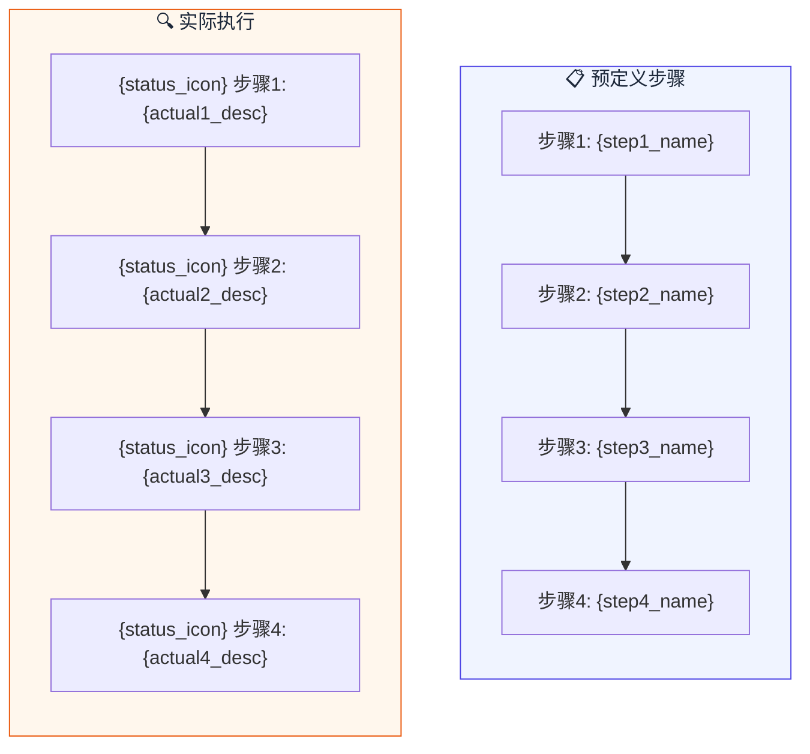
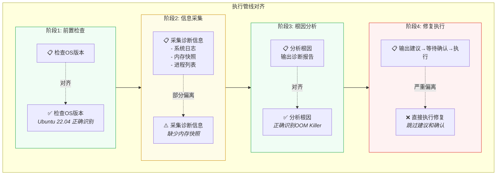

# 过程追溯 Mermaid 图模板

## 基础对比图

## 详细对齐图（含偏差标注）

## 标签说明

| 标签 | 含义 | 示例场景 |
|:---:|------|------|
| ✅ | 符合预期 | 执行了 Skill 规定的步骤且结果正确 |
| ⚠️ | 部分偏离 | 执行了但参数/顺序/结果与预期有偏差 |
| ❌ | 非预期调用 | 执行了 Skill 未规定的操作（潜在风险） |
| ⭕ | 跳过 | Skill 写了但未执行（能力缺口） |
