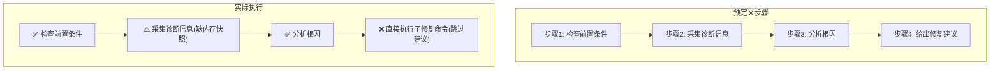

# Skill Evaluator — Agent 技能三维评测引擎

> **定位**：不是"这个 Skill 好不好"的主观判断——是**执行精准度 × 端到端时效 × 计算成本**的三维量化评测，加过程追溯和靶向归因。
>
> **核心理念**：只看终点的评测等于闭眼开车。Skill 评测必须回答三个问题——结果对不对、路径偏不偏、成本划不划算。

## 触发条件

### 自动触发（推荐模式）

**每次 Agent 会话结束后自动运行**。检测条件：
1. 当前会话中使用了至少一个 Skill
2. 任务执行已完成（有明确产出或用户确认结束）

自动触发时，按「快速模式」执行：采集执行数据 → 三维打分 → 简要报告。不阻塞用户下一步操作。

### 手动触发

| 信号 | 示例 |
|------|------|
| 用户要求评测具体 Skill | "帮我评测一下 troubleshooter 这个 skill" |
| 用户询问 Skill 质量 | "这个 skill 质量怎么样？准不准？" |
| 用户要求质量报告 | "给我一份最近所有 skill 的质量报告" |
| 用户怀疑 Skill 有问题 | "这个 skill 是不是有问题？经常跑偏" |

### 不触发场景

- 纯对话/问答任务（无 Skill 调用）
- 用户明确表示"不需要评测"
- Creative 生成类任务（海报/漫画/ASCII 艺术——产出质量高度主观，不适合自动量化评测）

---

## 核心能力

### 三维评测指标

```
┌──────────────────────────────────────────────────┐
│             Skill 三维评测模型                      │
├────────────────┬─────────────────┬───────────────┤
│ 执行精准度      │ 端到端时效        │ 计算成本       │
│ Effectiveness  │ Efficiency       │ Token Cost    │
├────────────────┼─────────────────┼───────────────┤
│ 工具调用序列    │ 总耗时拆到阶段     │ Input Tokens  │
│ 是否偏离预期路径 │ 每轮思维链耗时     │ Output Tokens │
│ 多余操作/遗漏   │ 上下文加载时间     │ 模型单价      │
│ API 调用正确性  │ 响应延迟分布      │ 总费用(USD)   │
└────────────────┴─────────────────┴───────────────┘
```

### 过程追溯（Mermaid 可视化）

任务执行后，自动生成 Mermaid 流程图，与 Skill 预定义步骤逐项对齐：

- ✅ 符合预期 — 执行了 Skill 规定的步骤且结果正确
- ⚠️ 部分偏离 — 执行了但参数/顺序/结果与预期有偏差
- ❌ 非预期调用 — 执行了 Skill 未规定的操作（潜在风险）
- ⭕ 跳过 — Skill 写了但未执行（能力缺口）

### 靶向归因

失败时精确分锅：
- **Skill 的锅**：缺少版本兼容约束、漏了前置依赖、步骤描述模糊导致 Agent 歧义
- **模型的锅**：排障文档明确写了禁止操作但模型仍然执行、多轮交互后生成越权指令
- **环境的锅**：OS 版本升级、依赖路径变更、权限问题等外部因素

### 高阶指标

- **CPSR（Cost Per Successful Result）**：每次成功结果的成本 = 总 Token 成本 / 成功任务数
- **Skill 提升率**：优化前后对比的评分变化百分比
- **偏离率**：执行路径偏离预期的比例

---

## 数据自动采集架构

### 三层保障体系

```
层1: B-2 Gateway Hook (主力 — 实时事件驱动)
  触发方式: Hermes agent:end 事件（每次 Agent 回复完成后）
  注册方式: ~/.hermes/hooks/skill-eval/HOOK.yaml + handler.py
  覆盖范围: 100%（内核级事件，非轮询）
  延迟: 0（事件发生即触发）
  适用: Gateway 模式（Feishu/Telegram/Discord 等）

层2: Cron 增量轮询 (兜底 — 10分钟)
  触发方式: 每 10 分钟 `auto_eval_trigger.py --mode incremental --quiet`
  运行方式: no_agent=true 脚本直跑（零 token 开销），包装脚本 `~/.hermes-feishu/scripts/skill_auto_eval.sh`
  增量逻辑: 通过 `_auto_trigger_state.json` 中的 `last_check` 时间戳过滤会话文件 mtime
  覆盖范围: 补漏（Hook 未重启、Gateway 未运行时）
  去重: 跳过 `_evaluated_sessions.json` 中已有记录
  首次运行: `last_check` 为空时回退到 `--recent N` 模式扫描最近会话

层3: 手动触发 (按需)
  触发方式: 用户说"评测一下这个 skill"
```

### 去重机制

Hook 和 Cron 共享同一个去重注册表 `~/.hermes-feishu/eval_results/_evaluated_sessions.json`：

```
Hook 先执行（实时） → 写入 session_id 到注册表
Cron 后执行（定时） → 检查注册表 → 已有 → 跳过
```

两个入口代码中均读取同一文件：
- `~/.hermes/hooks/skill-eval/handler.py` → `save_evaluated()`
- `scripts/auto_eval_trigger.py` → `EVALUATED_REGISTRY` → 过滤已评测会话

### ⚠️ 关键区分：Hook 不是轮询

`session_watcher.py` 是**文件轮询器**（5s 检查一次文件变化），不是真正的 hook。它作为 B-1 方案的升级版仍然可用，但：
- 真正的 B-2 是 Gateway hook（`agent:end` 事件驱动）
- Hook 是 Hermes 内核在会话结束时**主动调用**你的回调
- 轮询是你**定时主动检查**有没有新文件

当用户说 "hook" 时，指的是事件驱动回调，不是轮询。不要混用术语。

### 模式一：自动触发（快速模式）

```
会话结束 → 检测 Skill 使用 → [是] → 采集执行数据 → 三维快速打分 → 简要报告
                                    → [否] → 跳过
```

**快速模式特点**：
- 采集范围：当前会话
- 评分粒度：三维综合评分（1-5分），不逐步骤追溯
- 输出格式：简要 Markdown 报告
- 持久化：结果存入 `~/.hermes-feishu/eval_results/`

### 模式二：手动触发（完整模式）

#### Phase 1: 确定评测目标

从用户输入中提取：
- 目标 Skill 名称/路径
- 评测范围（单次执行 / 最近 N 次 / 全部历史）
- 是否需要与其他 Skill 对比

若用户未明确，询问：
```
要对哪个 Skill 做评测？
1. 指定 Skill 名称
2. 最近使用过的 Skill（列出可选）
3. 全部已注册 Skill 批量评测
```

🔴 **CHECKPOINT** — 评测目标已确定。确认后进入 Phase 2：
>- [ ] 目标 Skill 名称/路径已明确？
>- [ ] 评测范围已确认（单次/N次/全量）？
>- [ ] 若批量评测，数量是否合理（≤5）？

#### Phase 2: 采集执行数据

从 Hermes 会话历史中提取目标 Skill 的执行记录：

1. 读取最近的会话记录（通过 `session_search` 或本地日志）
2. 提取包含目标 Skill 的会话
3. 逐条解析：
   - 工具调用序列和参数
   - 每步耗时
   - Token 消耗
   - 错误/异常信息
   - 最终产出

#### Phase 3: 静态合规检查（L1）

在 LLM 评估之前，先跑确定性检查：

| 检查项 | 方法 | 严重度 |
|--------|------|:---:|
| SKILL.md 结构完整性 | 检查必需章节（name/description/triggers/执行流程） | medium |
| 脚本语法 | 每个 .sh/.py 文件跑语法检查（`bash -n` / `python3 -m py_compile`） | high |
| 引用完整性 | 检查引用的脚本/references 文件是否存在 | high |
| 高危指令扫描 | 扫描 `rm -rf /*`、`DROP TABLE` 等高危操作 | critical |
| Description 可触发性 | 检查 description 是否包含具体信号词 | low |
| 渐进式加载 | SKILL.md 是否 < 500 行，详细内容是否外置到 references/ | low |

#### Phase 4: LLM 六维质量评估（L2）

🔴 **CHECKPOINT** — L1 静态检查已完成。进入 L2 LLM 评估前确认：
>- [ ] L1 检查结果已复核（高危项是否已修复？）
>- [ ] 若存在 critical 级问题，不应跳过直接进入 L2

调用 LLM 对 SKILL.md 内容进行六维打分（1-5分）：

| 维度 | 评估内容 | 权重 |
|------|---------|:---:|
| **目的适配性** | 职责是否聚焦单一目标；description 是否能让 LLM 准确判断调用时机 | 25% |
| **结构规范性** | 内容精炼度、信息密度、渐进式披露设计 | 20% |
| **指令适配性** | 指令自由度是否与任务风险等级匹配 | 20% |
| **内容一致性** | 术语统一、表达风格一致、无硬编码时效信息 | 15% |
| **工程健壮性** | 脚本质量、错误处理、幂等性、前置校验 | 10% |
| **安全风险性** | 是否包含不安全操作模式、缺少安全约束 | 10% |

每条 issue 必须包含：`summary`（≤30字）、`severity`、`evidence`（引用原文）、`suggestedFix`。

#### Phase 5: 执行轨迹对齐

取最近 N 次执行记录，逐次对比预定义步骤：

1. 从 Skill 的 SKILL.md 中提取预定义步骤流程
2. 从执行日志中提取实际工具调用序列
3. 逐步骤比对，打 ✅⚠️❌⭕ 标签
4. 生成 Mermaid 对比流程图



#### Phase 6: 靶向归因

🔴 **CHECKPOINT** — 执行轨迹对齐已完成。进入靶向归因前确认：
>- [ ] 所有 ❌/⚠️ 步骤是否已记录？
>- [ ] 归因分析是否区分了 Skill/模型/环境三个维度？

若存在 ❌ 或 ⚠️ 步骤，进行根因分析：

```
问题: 步骤4 跳过了"给出修复建议"直接执行修复命令

归因分析:
├── Skill 层面: SKILL.md 中步骤4描述为"进行修复"，
│   未区分"建议"和"执行"，导致 Agent 直接执行
│   → 归因: Skill 指令模糊 (confidence: 0.85)
│
├── 模型层面: 多轮交互后模型产生了"已完成诊断"
│   的错觉，未检查步骤完整性
│   → 归因: 模型步骤遵循缺陷 (confidence: 0.45)
│
└── 结论: 主因是 Skill 指令不够明确，
    建议将步骤4拆分为 4a(输出建议) 和 4b(确认后执行)
```

#### Phase 7: 输出评测报告

🔴 **CHECKPOINT** — 靶向归因已完成。输出报告前确认：
>- [ ] 报告中是否包含三维评分 + 过程追溯 + 靶向归因？
>- [ ] 每个 issue 是否有 severity + evidence + suggestedFix？
>- [ ] 报告是否已持久化到 eval_results/ 目录？

完整报告结构见 `references/report-template.md`。

---

## 数据持久化

评测结果存储在 `~/.hermes-feishu/eval_results/` 目录：

```
~/.hermes-feishu/eval_results/
├── index.json                    # 评测索引（按 Skill 名索引）
├── {skill_name}/
│   ├── {timestamp}_auto.json     # 自动触发评测结果
│   ├── {timestamp}_manual.json   # 手动触发评测结果
│   └── history.json              # 该 Skill 的评测趋势数据
```

每份评测结果包含：
```json
{
  "skill_name": "skill-evaluator",
  "skill_version": "1.0.0",
  "eval_time": "2026-06-21T15:30:00+08:00",
  "trigger": "auto",
  "overall_score": 4.2,
  "dimensions": {
    "effectiveness": {"score": 4.0, "details": "..."},
    "efficiency": {"score": 4.5, "details": "..."},
    "cost": {"score": 4.0, "details": "..."}
  },
  "trace_alignment": [
    {"step": "步骤1", "status": "✅", "detail": "..."},
    {"step": "步骤2", "status": "⚠️", "detail": "缺内存快照"}
  ],
  "attribution": [
    {"target": "skill", "issue": "指令模糊", "confidence": 0.85}
  ],
  "issues": [
    {"severity": "medium", "summary": "...", "suggestedFix": "..."}
  ],
  "cpsr": 0.0023,
  "total_tokens": 45000,
  "duration_ms": 32000
}
```

---

## 反例（禁止）

- ❌ 只看任务是否完成就给满分 — 必须检查执行路径
- ❌ 不采集执行数据就下结论 — 评测必须基于真实数据
- ❌ 对创意类 Skill 强行量化打分 — 仅对确定性问题域用此技能
- ❌ 归因只说"Skill 有问题"不给具体位置 — 必须精确到章节/步骤
- ❌ 评测后不生成改进建议 — 评测的终点是优化方向

---

## 失败模式与恢复

| # | 触发条件 | 症状 | 一线修复 | 仍失败 → fallback |
|---|---------|------|---------|-------------------|
| 1 | `session_search` 无结果或超时 | Phase 2 采集不到执行数据 | 降级为 `glob ~/.hermes-feishu/sessions/session_*.json` 直接读取文件 | 标记 `data_source=fallback_file_scan`，评分可信度降级为 `medium` |
| 2 | SKILL.md 中无预定义步骤 | Phase 5 轨迹对齐缺少预期路径 | 从 `description` 和 `triggers` 字段推断预期行为 | 跳过轨迹对齐，报告中标注「缺少预定义步骤——无法完成过程追溯」 |
| 3 | LLM 评测 API 超时/限流 | Phase 4 六维评分中断 | 重试 1 次（间隔 3s）；仍失败 → 仅输出 L1 静态检查结果 | L2 标注为 `skipped (API unavailable)`，不影响 L1 评分 |
| 4 | `_evaluated_sessions.json` 损坏 | 去重失效，重复评测 | 备份损坏文件 → 重建空注册表 → 重新采集 | 若重建后仍有重复，手动清理 `eval_results/` 目录 |
| 5 | 自动触发时 Skill 未在 `related_skills` 中注册 | 遗漏评测 | 扫描 `signals.jsonl` 反查实际调用的 Skill | 在报告中标注「未注册但实际使用的 Skill」并建议补全注册 |
| 6 | `eval_results/` 目录权限不足 | 评测结果无法持久化 | `chmod 755 ~/.hermes-feishu/eval_results/` | 输出到 `/tmp/eval_fallback_{timestamp}.json`，提示用户手动迁移 |
| 7 | Gateway Hook 未启动（cron 兜底） | auto trigger 未在会话结束时触发 | cron 增量轮询补漏（10 分钟延迟） | 报告标注 `trigger=delayed_auto`，CPSR 指标注明采集延迟 |

## Pitfalls

### `--mode incremental` 不真正过滤（已修复 2026-06-22）

`auto_eval_trigger.py` 曾存在一个缺陷：`--mode incremental` 参数被 argparse 解析了，但 `main()` 中从未使用它来过滤会话。`load_state()` 返回的 `last_check` 时间戳从未传给 `get_recent_sessions()`，导致每次 cron 运行都评测全部历史会话。

**修复要点**（已在 `auto_eval_trigger.py` 中落实）：
1. `get_recent_sessions()` 新增 `since: Optional[str]` 参数，按 `mtime > since_ts` 过滤会话文件
2. `main()` 在 `args.mode == "incremental"` 时传入 `state["last_check"]` 作为 `since`
3. 增量模式下 `effective_count` 设为 `max(args.recent * 10, 100)` 确保不漏新会话
4. **无新会话时也更新 `last_check`**：防止连续多次无新会话后时间戳过期，导致下次运行漏掉中间出现的新会话

### 数据源三层过滤完整性（已修复 2026-06-22）

`get_recent_sessions()` 有三个回退数据源，原实现中只有 数据源1 支持 `since` 增量过滤：

| 数据源 | 内容 | 原过滤 | 修复后 |
|--------|------|:---:|:---:|
| Source 1 | glob `session_*.json` 直接扫文件 | ✅ mtime 过滤 | ✅ (修复 glob 排除 `.jsonl`) |
| Source 2 | `sessions.json` 索引 | ❌ 无过滤 | ✅ `updated_at`/`created_at` 时间戳过滤 |
| Source 3 | `eval_results/index.json` | ❌ 无过滤 | ✅ `timestamp` 时间戳过滤 |

**陷阱**：若 Source 1 因 glob 太宽（`*.json` 匹配到 `.jsonl`）导致空结果，会 fallthrough 到 Source 2/3。修复前 Source 2 会返回所有历史会话（含 2026-05-25 的 `.jsonl` 文件），一旦被 `check_skill_sessions()` 误判为含 Skill，就会触发重复评测。

**glob 精确定**：`session_*.json`（仅匹配 `session_YYYYMMDD_*.json` 和 `session_cron_*.json`），排除 `.jsonl` 日志流文件和 `sessions.json` 索引自身。

### 不要手动修改 `_auto_trigger_state.json`

该文件由脚本自动维护。手动修改可能导致时间戳错位，增量模式过滤出大量历史会话。

### cron wrapper 脚本路径与执行环境（2026-06-22 验证）

cron runner 解析相对 `script` 路径的基目录是 `~/.hermes-feishu/scripts/`，不是 `~/.hermes/scripts/`。包装脚本 **必须直接放在** `~/.hermes-feishu/scripts/skill_auto_eval.sh`。

**三个关键陷阱**：

1. **不要用符号链接**：符号链接会导致 `$0`/`dirname` 解析到链接所在目录而非目标目录，相对路径推导出错。直接写入脚本文件。

2. **cron 环境没有 venv python3**：cron 执行的 PATH 不包含 venv。裸 `python3` 会失败。必须用绝对路径 `/home/aorus/.hermes/hermes-agent/venv/bin/python3`。

3. **Python 脚本也用绝对路径**：不依赖 `$0`/`dirname` 推导，直接写死 `/home/aorus/.hermes-feishu/skills/ai-engineering/skill-evaluator/scripts/auto_eval_trigger.py`。

**正确的包装脚本内容**（`~/.hermes-feishu/scripts/skill_auto_eval.sh`）：

```bash
#!/usr/bin/env bash
set -euo pipefail

# Handle bare cron environment where HOME may be unset
if [ -z "${HOME:-}" ]; then
    export HOME="/home/aorus"
fi

exec /home/aorus/.hermes/hermes-agent/venv/bin/python3 \
  /home/aorus/.hermes-feishu/skills/ai-engineering/skill-evaluator/scripts/auto_eval_trigger.py \
  --mode incremental
```

cron job 配置使用相对路径 `script: "skill_auto_eval.sh"`（cron runner 自动解析到 `~/.hermes-feishu/scripts/`）。

## 参考文件

- `references/report-template.md` — 完整评测报告模板
- `references/scoring-rubric.md` — 六维打分细则
- `references/mermaid-template.md` — 过程追溯 Mermaid 图模板
- `references/hermes-session-format.md` — Hermes 会话 JSON 格式与数据提取陷阱
- `references/hermes-hook-setup.md` — Gateway Hook 配置指南
- `scripts/collect_trace.py` — 执行数据采集脚本（直读 session JSON）
- `scripts/static_check.sh` — L1 静态合规检查脚本
- `scripts/auto_eval_trigger.py` — 自动触发评测（cron 增量模式）
- `scripts/session_watcher.py` — B-2 文件监听器（备用）
- `~/.hermes-feishu/scripts/skill_auto_eval.sh` — cron no_agent 包装脚本（每 10 分钟调用 auto_eval_trigger.py --mode incremental）。⚠️ cron runner 解析相对 script 路径的基目录是 `~/.hermes-feishu/scripts/`，非 `~/.hermes/scripts/`。
