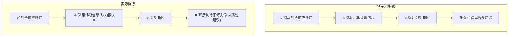

# Skill Evaluator — Agent 技能三维评测引擎

> **定位**：不是"这个 Skill 好不好"的主观判断——是**执行精准度 × 端到端时效 × 计算成本**的三维量化评测，加过程追溯和靶向归因。
>
> **核心理念**：只看终点的评测等于闭眼开车。Skill 评测必须回答三个问题——结果对不对、路径偏不偏、成本划不划算。

## 触发条件

### 自动触发（推荐模式）

**每次 Agent 会话结束后自动运行**。检测条件：
1. 当前会话中使用了至少一个 Skill
2. 任务执行已完成（有明确产出或用户确认结束）

自动触发时，按「快速模式」执行：采集执行数据 → 三维打分 → 简要报告。不阻塞用户下一步操作。

### 手动触发

| 信号 | 示例 |
|------|------|
| 用户要求评测具体 Skill | "帮我评测一下 troubleshooter 这个 skill" |
| 用户询问 Skill 质量 | "这个 skill 质量怎么样？准不准？" |
| 用户要求质量报告 | "给我一份最近所有 skill 的质量报告" |
| 用户怀疑 Skill 有问题 | "这个 skill 是不是有问题？经常跑偏" |

### 不触发场景

- 纯对话/问答任务（无 Skill 调用）
- 用户明确表示"不需要评测"
- Creative 生成类任务（海报/漫画/ASCII 艺术——产出质量高度主观，不适合自动量化评测）

---

## 核心能力

### 三维评测指标

```
┌──────────────────────────────────────────────────┐
│             Skill 三维评测模型                      │
├────────────────┬─────────────────┬───────────────┤
│ 执行精准度      │ 端到端时效        │ 计算成本       │
│ Effectiveness  │ Efficiency       │ Token Cost    │
├────────────────┼─────────────────┼───────────────┤
│ 工具调用序列    │ 总耗时拆到阶段     │ Input Tokens  │
│ 是否偏离预期路径 │ 每轮思维链耗时     │ Output Tokens │
│ 多余操作/遗漏   │ 上下文加载时间     │ 模型单价      │
│ API 调用正确性  │ 响应延迟分布      │ 总费用(USD)   │
└────────────────┴─────────────────┴───────────────┘
```

### 过程追溯（Mermaid 可视化）

任务执行后，自动生成 Mermaid 流程图，与 Skill 预定义步骤逐项对齐：

- ✅ 符合预期 — 执行了 Skill 规定的步骤且结果正确
- ⚠️ 部分偏离 — 执行了但参数/顺序/结果与预期有偏差
- ❌ 非预期调用 — 执行了 Skill 未规定的操作（潜在风险）
- ⭕ 跳过 — Skill 写了但未执行（能力缺口）

### 靶向归因

失败时精确分锅：
- **Skill 的锅**：缺少版本兼容约束、漏了前置依赖、步骤描述模糊导致 Agent 歧义
- **模型的锅**：排障文档明确写了禁止操作但模型仍然执行、多轮交互后生成越权指令
- **环境的锅**：OS 版本升级、依赖路径变更、权限问题等外部因素

### 高阶指标

- **CPSR（Cost Per Successful Result）**：每次成功结果的成本 = 总 Token 成本 / 成功任务数
- **Skill 提升率**：优化前后对比的评分变化百分比
- **偏离率**：执行路径偏离预期的比例

---

## 执行流程

### 模式一：自动触发（快速模式）

```
会话结束 → 检测 Skill 使用 → [是] → 采集执行数据 → 三维快速打分 → 简要报告
                                    → [否] → 跳过
```

**快速模式特点**：
- 采集范围：当前会话
- 评分粒度：三维综合评分（1-5分），不逐步骤追溯
- 输出格式：简要 Markdown 报告
- 持久化：结果存入 `~/.hermes-feishu/eval_results/`

### 模式二：手动触发（完整模式）

#### Phase 1: 确定评测目标

从用户输入中提取：
- 目标 Skill 名称/路径
- 评测范围（单次执行 / 最近 N 次 / 全部历史）
- 是否需要与其他 Skill 对比

若用户未明确，询问：
```
要对哪个 Skill 做评测？
1. 指定 Skill 名称
2. 最近使用过的 Skill（列出可选）
3. 全部已注册 Skill 批量评测
```

#### Phase 2: 采集执行数据

从 Hermes 会话历史中提取目标 Skill 的执行记录：

1. 读取最近的会话记录（通过 `session_search` 或本地日志）
2. 提取包含目标 Skill 的会话
3. 逐条解析：
   - 工具调用序列和参数
   - 每步耗时
   - Token 消耗
   - 错误/异常信息
   - 最终产出

#### Phase 3: 静态合规检查（L1）

在 LLM 评估之前，先跑确定性检查：

| 检查项 | 方法 | 严重度 |
|--------|------|:---:|
| SKILL.md 结构完整性 | 检查必需章节（name/description/triggers/执行流程） | medium |
| 脚本语法 | 每个 .sh/.py 文件跑语法检查（`bash -n` / `python3 -m py_compile`） | high |
| 引用完整性 | 检查引用的脚本/references 文件是否存在 | high |
| 高危指令扫描 | 扫描 `rm -rf /*`、`DROP TABLE` 等高危操作 | critical |
| Description 可触发性 | 检查 description 是否包含具体信号词 | low |
| 渐进式加载 | SKILL.md 是否 < 500 行，详细内容是否外置到 references/ | low |

#### Phase 4: LLM 六维质量评估（L2）

调用 LLM 对 SKILL.md 内容进行六维打分（1-5分）：

| 维度 | 评估内容 | 权重 |
|------|---------|:---:|
| **目的适配性** | 职责是否聚焦单一目标；description 是否能让 LLM 准确判断调用时机 | 25% |
| **结构规范性** | 内容精炼度、信息密度、渐进式披露设计 | 20% |
| **指令适配性** | 指令自由度是否与任务风险等级匹配 | 20% |
| **内容一致性** | 术语统一、表达风格一致、无硬编码时效信息 | 15% |
| **工程健壮性** | 脚本质量、错误处理、幂等性、前置校验 | 10% |
| **安全风险性** | 是否包含不安全操作模式、缺少安全约束 | 10% |

每条 issue 必须包含：`summary`（≤30字）、`severity`、`evidence`（引用原文）、`suggestedFix`。

#### Phase 5: 执行轨迹对齐

取最近 N 次执行记录，逐次对比预定义步骤：

1. 从 Skill 的 SKILL.md 中提取预定义步骤流程
2. 从执行日志中提取实际工具调用序列
3. 逐步骤比对，打 ✅⚠️❌⭕ 标签
4. 生成 Mermaid 对比流程图



#### Phase 6: 靶向归因

若存在 ❌ 或 ⚠️ 步骤，进行根因分析：

```
问题: 步骤4 跳过了"给出修复建议"直接执行修复命令

归因分析:
├── Skill 层面: SKILL.md 中步骤4描述为"进行修复"，
│   未区分"建议"和"执行"，导致 Agent 直接执行
│   → 归因: Skill 指令模糊 (confidence: 0.85)
│
├── 模型层面: 多轮交互后模型产生了"已完成诊断"
│   的错觉，未检查步骤完整性
│   → 归因: 模型步骤遵循缺陷 (confidence: 0.45)
│
└── 结论: 主因是 Skill 指令不够明确，
    建议将步骤4拆分为 4a(输出建议) 和 4b(确认后执行)
```

#### Phase 7: 输出评测报告

完整报告结构见 `references/report-template.md`。

---

## 数据持久化

评测结果存储在 `~/.hermes-feishu/eval_results/` 目录：

```
~/.hermes-feishu/eval_results/
├── index.json                    # 评测索引（按 Skill 名索引）
├── {skill_name}/
│   ├── {timestamp}_auto.json     # 自动触发评测结果
│   ├── {timestamp}_manual.json   # 手动触发评测结果
│   └── history.json              # 该 Skill 的评测趋势数据
```

每份评测结果包含：
```json
{
  "skill_name": "skill-evaluator",
  "skill_version": "1.0.0",
  "eval_time": "2026-06-21T15:30:00+08:00",
  "trigger": "auto",
  "overall_score": 4.2,
  "dimensions": {
    "effectiveness": {"score": 4.0, "details": "..."},
    "efficiency": {"score": 4.5, "details": "..."},
    "cost": {"score": 4.0, "details": "..."}
  },
  "trace_alignment": [
    {"step": "步骤1", "status": "✅", "detail": "..."},
    {"step": "步骤2", "status": "⚠️", "detail": "缺内存快照"}
  ],
  "attribution": [
    {"target": "skill", "issue": "指令模糊", "confidence": 0.85}
  ],
  "issues": [
    {"severity": "medium", "summary": "...", "suggestedFix": "..."}
  ],
  "cpsr": 0.0023,
  "total_tokens": 45000,
  "duration_ms": 32000
}
```

---

## 反例（禁止）

- ❌ 只看任务是否完成就给满分 — 必须检查执行路径
- ❌ 不采集执行数据就下结论 — 评测必须基于真实数据
- ❌ 对创意类 Skill 强行量化打分 — 仅对确定性问题域用此技能
- ❌ 归因只说"Skill 有问题"不给具体位置 — 必须精确到章节/步骤
- ❌ 评测后不生成改进建议 — 评测的终点是优化方向

---

## 参考文件

- `references/report-template.md` — 完整评测报告模板
- `references/scoring-rubric.md` — 六维打分细则
- `references/mermaid-template.md` — 过程追溯 Mermaid 图模板
- `scripts/collect_trace.py` — 执行数据采集脚本
- `scripts/static_check.sh` — L1 静态合规检查脚本
